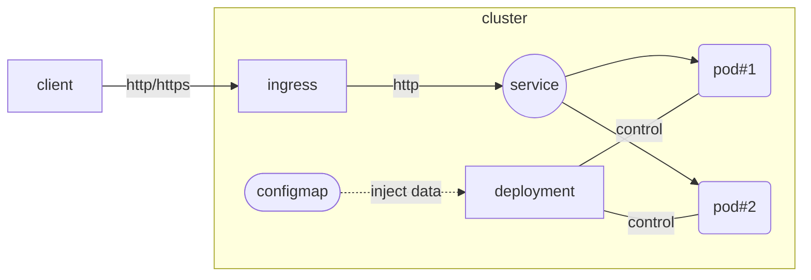

# UML example

```mermaid
graph LR
  client -- http/https --> ingress
  subgraph cluster
  ingress -- http --> s((service))
  s((service)) --> c(pod#1) & d(pod#2)
  deployment--- |control|c(pod#1) & d(pod#2)
  A([configmap]) -. inject data .->deployment
  end

```
