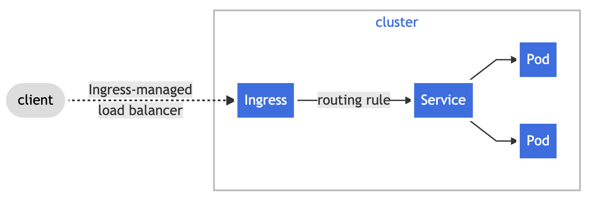

# [kubernetes](https://kubernetes.io/docs)

## Overview
> Container orchestration platform으로서, container의 life cycle과 가상화된 network과 storage를  
> 관리해주는 기능을 제공함.
> 관리되는 자원은 주로 namespace로 그룹되어 관리 되며, Custom Resource 및   
> Adminssion Plugin으로 kubernetes의 기능을 확장 할 수 있음

## 주요 Component

### Deployment(pod)

### Service

### Ingress

### Storage 사용방법
