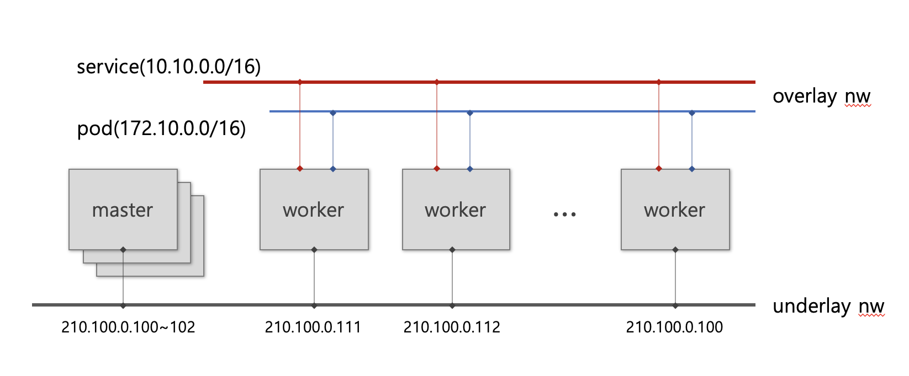

# [kubernetes](https://kubernetes.io/docs)

## Overview
> Container orchestration platform으로서, container의 life cycle과 가상화된 network과 storage를  
> 관리해주는 기능을 제공함.
> 관리되는 자원은 주로 namespace로 그룹되어 관리 되며, Custom Resource 및   
> Adminssion Plugin으로 kubernetes의 기능을 확장 할 수 있음

### infra structure


* master node: kubelet, kube-proxy, scheduler, etcd
* worker node: worload가 실행되는 서버들의 집합.
* pod : container의 집합으로 네트웍과 스토리지를 pod 내 container들이 공유함.  
  container image 및 어떻게 실행되어야 하는지 설정을 포함하며, 내부에 있는 container들은 life cycle을 같이함.

## 주요 Component
[](https://mermaid-js.github.io/mermaid-live-editor/#/edit/eyJjb2RlIjoiZ3JhcGggTFJcbiAgY2xpZW50IC0uIGh0dHAvaHR0cHMgLi0-IGluZ3Jlc3NcbiAgc3ViZ3JhcGggY2x1c3RlclxuICBpbmdyZXNzIC0tIGh0dHAgLS0-IHNlcnZpY2VcbiAgc2VydmljZSAtLT4gYyhwb2QjMSkgJiBkKHBvZCMyKVxuICBkZXBsb3ltZW50LS0tIHxjb250cm9sfGMocG9kIzEpICYgZChwb2QjMilcbiAgQShbY29uZmlnbWFwXSkgLS4gaW5qZWN0IGRhdGEgLi0-ZGVwbG95bWVudFxuICBlbmRcbiIsIm1lcm1haWQiOnt9LCJ1cGRhdGVFZGl0b3IiOmZhbHNlfQ)

> 모든 컴포넌트는 manifest에 의해 정의되고, kubelet과 scheduler에 의해 관리됨

### manifest block
```yaml
apiVersion: apps/v1
kind: [Deployment, StatefulSet, Service, Ingress, etc]
metadata:
  name: [name]
  labels:
    [key]: [value]
    ...
    [key]: [value]

spec:
  ...
```


###
### Deployment(pod)
> pod의 life cycle을 정의하고 pod의 instance를 정의할 수 있음.

```yaml
apiVersion: apps/v1
kind: Deployment
metadata:
  name: employees
  labels:
    app: employees
spec:
  replicas: 3         # 초기 pod instance 숫자를 정의
  selector:
    matchLabels:      # 관리대상 pod을 key:value로 대상을 지정함
      app: employees
  strategy:           # container 변경시 업데이트 방법을 지정함 rollingUpdate/Recreate
    rollingUpdate:
      maxSurge: 1     # rollingupdate 시에 rolling되는 pod의 숫자 단위
      maxUnavailable: 1 # rollingupdate 시 killed되는 pod 숫자 지정
    type: RollingUpdate # 복수의 pod을 순차적으로 교체처리함
  template:           # pod 정의
    metadata:
      labels:
        app: employees
    spec:
      containers:     # container 배열 정보. container 세부 정보 정의
        - name: employees # container name
          image: nogada/employees # registry uri
          imagePullPolicy: IfNotPresent # container image update 방법 지정
          ports:
            - containerPort: 8080 # container에서 사용되는 port
              name: tomcat      # 외부에서 port를 참조할 때 이름 방식으로 참조하기 위한 선언
          resources:    # container에서 사용되는 자원 할당. limie 값이 있어야 autoscale을 사용할 수 있음
            limits:
              cpu: 500m
              memory: 512Mi
            requests:
              cpu: 300m
              memory: 256Mi
          livenessProbe:  # pod이 활성화되었는지 check하는 방법 정의
            httpGet:
              path: /
              port: 8080
            initialDelaySeconds: 5
            periodSeconds: 60
          readinessProbe: # pod이 시작 되었는지 check하는 방법 정의
            httpGet:
              path: /
              port: 8080
            initialDelaySeconds: 30
            periodSeconds: 5
          volumeMounts:   # storage를 사용하기 위한 mount 정보
          - name: spring-properties
            mountPath: /app/config
      volumes:            # mount되는 storage의 유형 지정. PVC(PV), Configmap, Secret
      - name: spring-properties
        configMap:
          name: config
```


### Service
> pod과 통신을 위하기 위해 container를 expose 하는 방식 선언 정보
> pod ip는 dynamic하게 변경되기 때문에 service를 통해 연결되어야 함
> client -> service -> pod, pod -> service -> pod 방식의 연결

```yaml
apiVersion: v1
kind: Service
metadata:
  name: employees
spec:
  type: ClusterIP   # NodePort, ClusterIP(default), LoadBalancer
  selector:
    app: employees  # pod의 metadata.labels의 key value를 통해 대상 pod을 선택함.
  ports:
    - protocol: TCP # protocol TCP/UDP
      port: 80      # service port
      name: http    # 참조할 포트 이름. ingress 등에서 port 참조시 이름방식으로 사용됨
      targetPort: tomcat # pod의 port지정. pod container port 또는 port이름으로 지정
```

### Ingress
> http(s) 통신을 하기 위한 웹서버 역할을 수행하며, 소프트웨어 방식의 L7 스위치 기능을 제공하여,
> Host(Domain)정보와 하위 URL의 패턴으로 backend service를 연결 시켜줌
> TLS Offload 기능을 제공하며, SSL인증서는 sercret 형태로 등록하고 ingress 자원에서 쉽게 등록하여 처리 가능함

```yaml
apiVersion: networking.k8s.io/v1
kind: Ingress
metadata:
  name: ingress-wildcard-host
spec:
  rules:
  - host: "foo.bar.com"     # service 대상 domain name
    http:
      paths:
      - pathType: Prefix
        path: "/bar"        # routing 구분을 위한 하위 URL
        backend:
          service:
            name: service1
            port:
              number: 80
  - host: "*.foo.com"       # service 대상 domain name
    http:
      paths:
      - pathType: Prefix
        path: "/foo"        # routing 구분을 위한 하위 URL
        backend:
          service:
            name: service2
            port:
              number: 80

```

### Storage 사용방법
ref) [kubernetes](https://kubernetes.io/docs/concepts/storage/persistent-volumes/)

[](https://mermaid-js.github.io/mermaid-live-editor/#/edit/eyJjb2RlIjoiZ3JhcGggTFJcbiAgQVtjbGllbnRdIC0tPiBCW3NlcnZpY2VdXG4gIEIgLS0-IENbcG9kXVxuICBDIC0tPnx2b2x1bWUgbW91bnR8IERbcHZjXVxuICBFW3B2XSAtLiBwcm92aXNpb24gLi0-IERcbiAgRSAtLiBzcGVjIC4tPiBGW3N0b3JhZ2UgY2xhc3NdIiwibWVybWFpZCI6eyJ0aGVtZSI6ImRlZmF1bHQifSwidXBkYXRlRWRpdG9yIjpmYWxzZX0)

### 구성요소

* storage class : Block/File system을 연결하기 위한 기능 제공. CSI(Container Storage Inteface)를 통해  
  스토리지의 Life cycle을 지원함
* PV(Persistent Volume): 제공되는 저장소 Instance로서 accessmode(R/W/Once/Many)와 용량 재사용방법등의 정보를 관리함  
  ```yaml
  apiVersion: v1
  kind: PersistentVolume
  metadata:
    name: pv0003
  spec:
    capacity:
      storage: 5Gi
    volumeMode: Filesystem
    accessModes:
      - ReadWriteOnce
    persistentVolumeReclaimPolicy: Recycle
    storageClassName: slow
    mountOptions:
      - hard
      - nfsvers=4.1
    nfs:
      path: /tmp
      server: 172.17.0.2
  ```
* PVC(Persistent Volume Claim) : Storage를 사용하는 pod과 실제 PV를 mapping처리  
  ```yaml
  apiVersion: v1
  kind: PersistentVolumeClaim
  metadata:
    name: myclaim
  spec:
    accessModes:
      - ReadWriteOnce
    volumeMode: Filesystem
    resources:
      requests:
        storage: 8Gi
    storageClassName: slow
    selector:
      matchLabels:
        release: "stable"
      matchExpressions:
        - {key: environment, operator: In, values: [dev]}
  ```
* 사용예  
  ```yaml
  apiVersion: v1
  kind: Pod
  metadata:
    name: mypod
  spec:
    containers:
      - name: myfrontend
        image: nginx
        volumeMounts:
        - mountPath: "/var/www/html"
          name: mypd
    volumes:
      - name: mypd
        persistentVolumeClaim:
          claimName: myclaim
  ```

